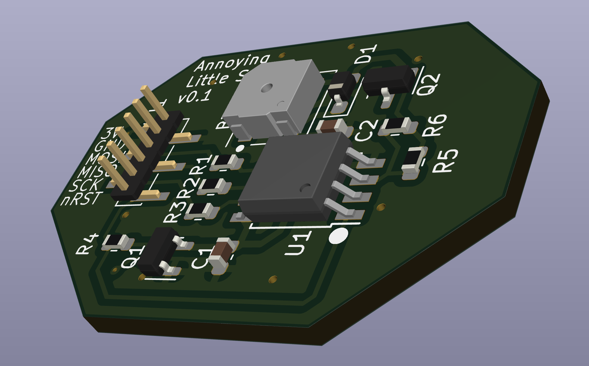

# Annoying Little Shit hardware

This repository contains the KiCAD design files for the
Annoying Little Shit (ALS) device, which is an AVR ATTiny13-based
device which wakes up at random intervals and beeps loudly. It is
designed to be annoying.

The buzzer is rated at 80 dB @ 4 kHz, and testing has found it to
be loud enough!

The firmware for the device can be found [here](https://github.com/frippertronics/als)!
